## Installation

Tested with Python 2.7.

### Install Required Packages
```
cd extraction
pip install -r requirements.txt
```

### Import nltk

```
$ python
>>> import nltk
>>> nltk.download()
```
In the UI, click on the Corpora tab. Scroll down and select stopwords, then click download.

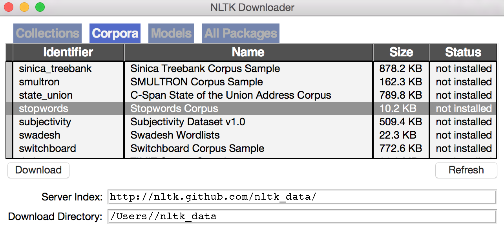

## Run
```
cd src
python runserver.py

go to:

localhost:5000
```

## Data Extraction

### Create a Project

Click “Select Project” and choose “Add New Project”. 

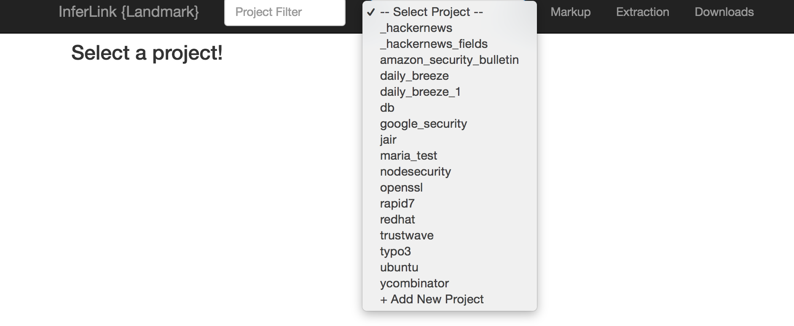

Input project name and click “Let’s Go!”.

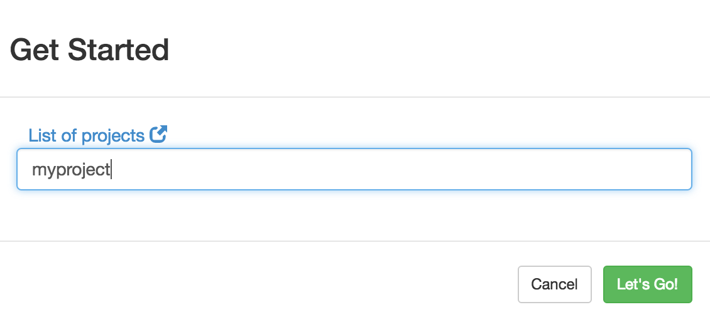


### Markup 

The Markup tab allows you to add sample pages and define the schema.

### Item Extraction

As an example we will use the JAIR (Journal of Artificial Intelligence Research) website: http://www.jair.org/

### Add Sample Pages

Select and label at least three sample pages and use the “Add Page” button to add them. For each page, click “Add Page”, and input the URL of the sample page. We will use the three following sample pages to demonstrate a few markup features. Once the pages have been added, we will define the extraction schema.
```
http://www.jair.org/papers/paper4866.html
http://www.jair.org/papers/paper5007.html
http://www.jair.org/papers/paper5058.html
```

To delete a page, hover over the page name (e.g., page_1.html) and click on the “x”.

### Define Schema

Let’s assume that for the JAIR articles we are interested in the “authors”, “title” and “abstract”.

In the Schema Definition section click on “Root” and then on “Create Item”. This will generate a new node under “Root” that we will call “authors”. As soon as we create a new node, we will see a placeholder for that node in the Sample Page section. 

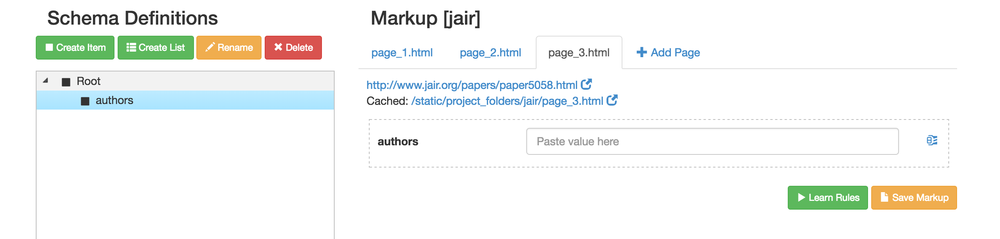

Now we can do the same actions for the items “title” and “abstract”.

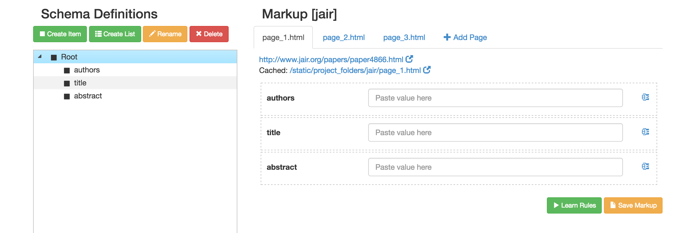

To delete a node from the schema, click on that node, and then on “Delete”.

### Sample Page Markup

Now that we have defined our schema and we have sample pages, we have to input sample values for each of the schema items.

#### Simple Markup

In the Markup/Sample Page section click on page_1.html, go to the page (http://www.jair.org/papers/paper4866.html or cached page - see “Special Cases” below), and copy the authors. Paste the authors in the “authors” placeholder. Do the same for “title” and abstract. Once you have completed the markup for one page click the “Save Markup” button (this operation is not necessary, but is suggested).

**NOTE:** It is recommended that you use the cached page for markup. The original page may change from the time it was added, to the time when you start the markup. If this happens the markup will not be accurate.

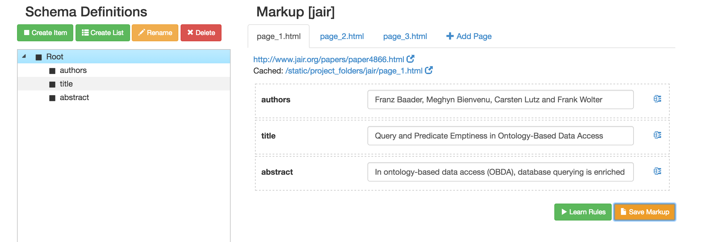

#### Special Cases

Now let’s proceed to markup page_2.html. Go to http://www.jair.org/papers/paper5007.html and copy/paste the authors in the “authors” placeholder of page_2.html. You will see a red notification next to the authors. This suggests that the system has trouble interpreting the data, in this case the special characters.

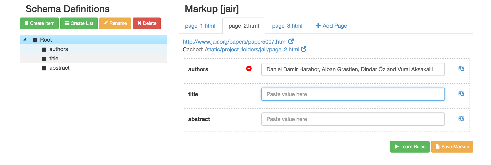

**Copy data directly from HTML:** For this situation go directly to the HTML and copy the data from there. In Chrome, go to View/Developer/View Source and find/copy/paste the authors. Now the system understands the input. Complete page_2.html by adding the title and abstract. Save Markup.

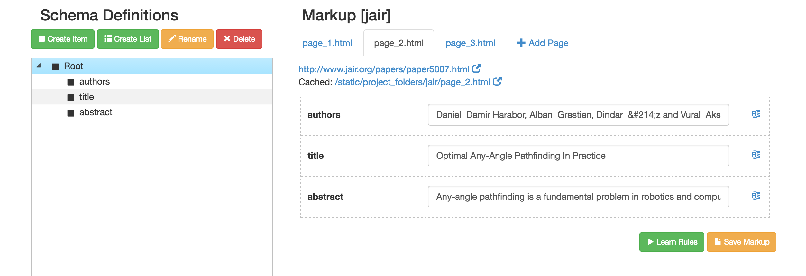


Next we add data to page_3.html. While adding the abstract we will see a notification. This suggests that the system has trouble interpreting the data, in this case the newline present between paragraphs of the abstract.

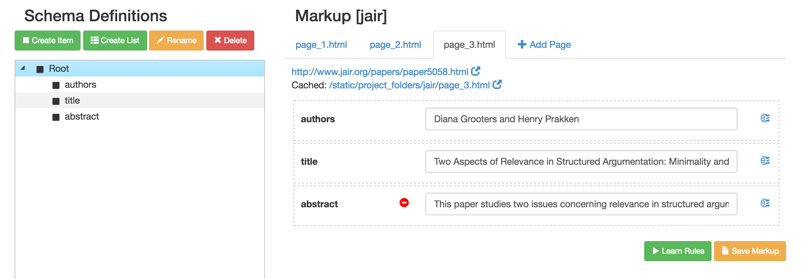

**Splitting the data:** For this situation, click on the blue “split icon” present at the end of the text field. This will generate two input boxes. In the first box input the first paragraph, and in the second box input the last paragraph. Now the system understands the input. Save Markup.

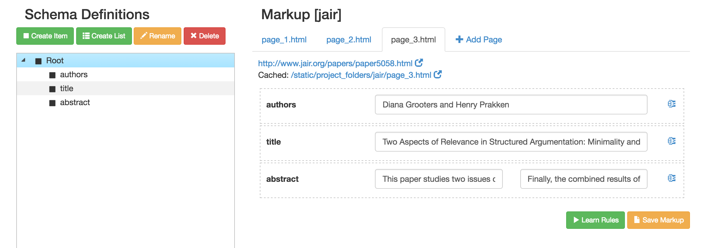

**Data from cached page:** If the pages that you are extracting from tend to be dynamic (change over time) you should copy/paste from the cached page instead of the live page. Click on “page_1.html” and then on the “Cached” page.

### List Extraction

As an example we will use a news website: https://news.ycombinator.com/

### Add Sample Pages

Select at least three sample pages and use the “Add Page” button to add them. 
```
https://news.ycombinator.com/
https://news.ycombinator.com/news?p=2
https://news.ycombinator.com/news?p=3
```

### Define Schema

Each page lists article titles and related information, and for each entry we would like to extract the article title, publication, and number of comments.

In the Schema Definition section click on “Root” and then on “Create List”. This will generate a new node under “Root” that we will call “articles”. As soon as we create a new list, we will see a placeholder for that list in the Sample Page section. 

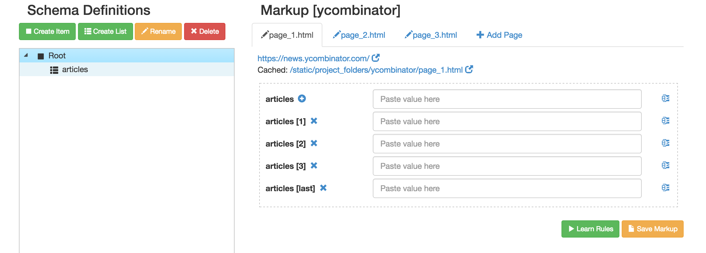

Now we have to add the items to be extracted for each article. Click on “articles”, and then “Create Item”. Name the first added item “title”, and then create two more items, “publication” and “comments”.

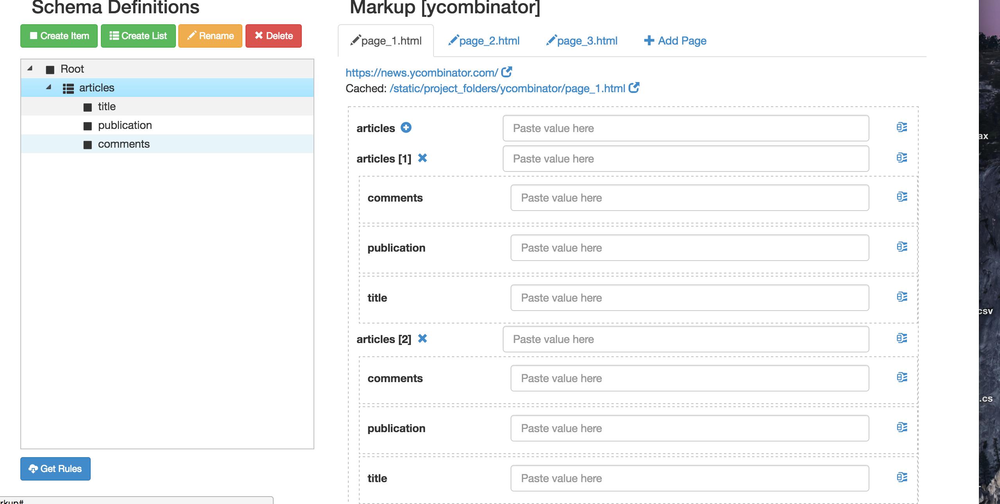

### Sample Page Markup

In order to extract a list of items the system has to understand where the list starts and ends, as well as the pattern between list rows. For this reason we have to give the system a few examples (the first three list rows, as well as the last one). For the three items: “title”, “publication” and “comments”, we will input data based on instructions given in the “Item Extraction” section. 


For each row we also have to input the start and end of the desired extraction. Split the row field “articles[1]” and input the first and last item in the row extraction. 

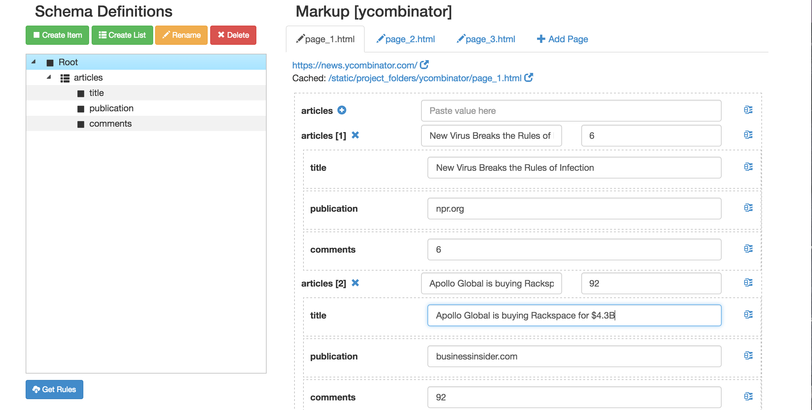


Repeat for all three sample pages.


#### Special Cases

**Adding a new row:** It may happen that the first three rows are not enough to correctly learn the rules (see “Learn Rules” below), in which case we have to add additional sample rows. We can do that by clicking the “+” next to the list name. Input the row **number** that you would like to add, and click “Add It”. For example, if you already have three rows, add “4” to add row number 4.

To delete a row click on the “x” that is next to the row.

**Same markup for different items:** If different items within the same row of a list have the same markup, the rule learning algorithm may have trouble learning correctly the begin/end of row especially if the begin or end item is the one whose markup coincides with another item in that same row. Consider the example below where “vulnerability” has a value of “<=1.6.8 and “severity” has a value of “6.8”. The value “6.8” appears in both, so  in order for the algorithm to know exactly which “6.8” is the end of row we have to include additional information for the row markup (advisories[last]). In this case, the end of row value is set to “cvss-score">6.8”. The additional information tells the system exactly which “6.8” is the end of row.

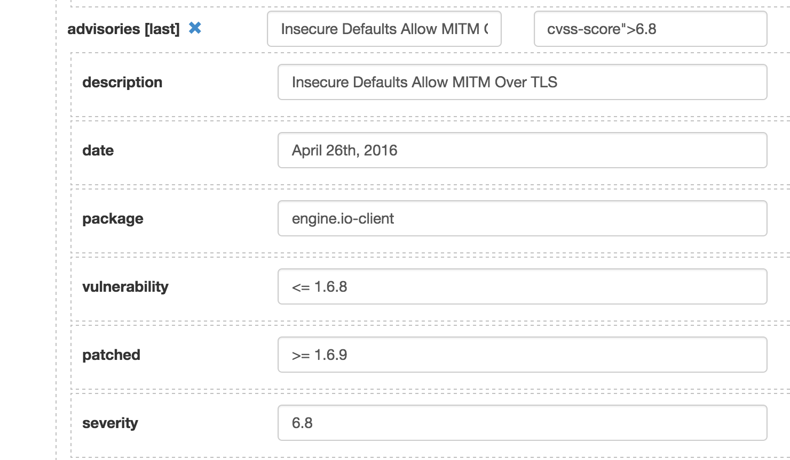

**One page website:** As specified above, we have to select at least three pages for markup. In the case of “one page” websites (where we do not have three pages), we can add the same page three times and label different parts of the page. For example, consider a one page website consisting of a list of security bulletins.

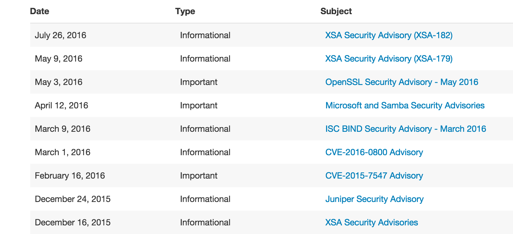

In this case we add the page 3 times, but for each page we label different parts of the list. For page 1 we label rows 1,2,3 and last; for page 2 we label rows 1,4,5,6 and last; for page 3 we label rows 1,7,8,9 and last.

**NOTE:** For each list we ALWAYS have to include the first and last row.

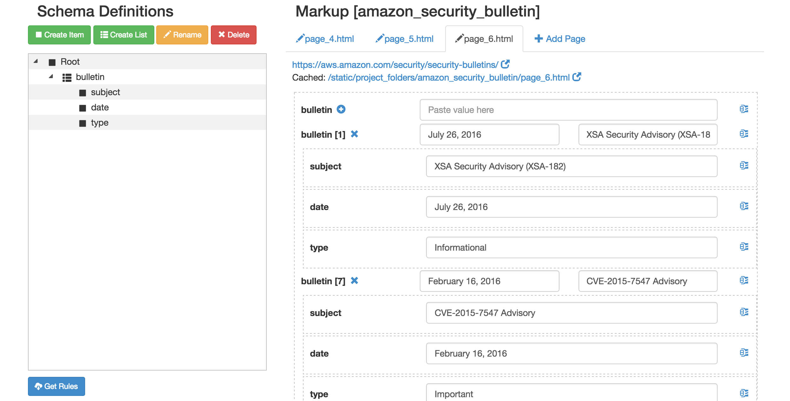

**Lists with less than three rows:** If a list contains less than three rows, include in the markup all rows, and DO NOT include a “last” row. Use the add/delete row buttons to generate the correct number of rows.

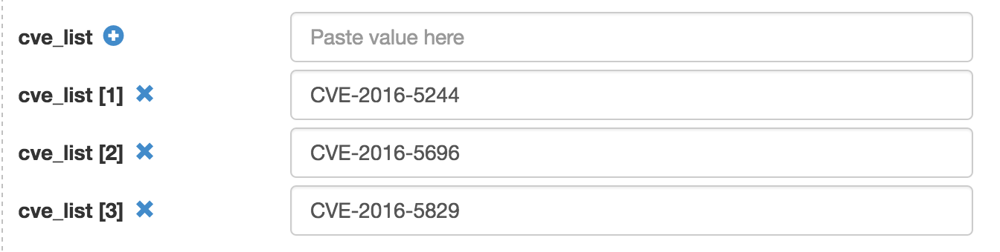

### List-of-Lists Extraction

In the example below we would like to extract a list of security notices, with each row containing a list of CVEs.

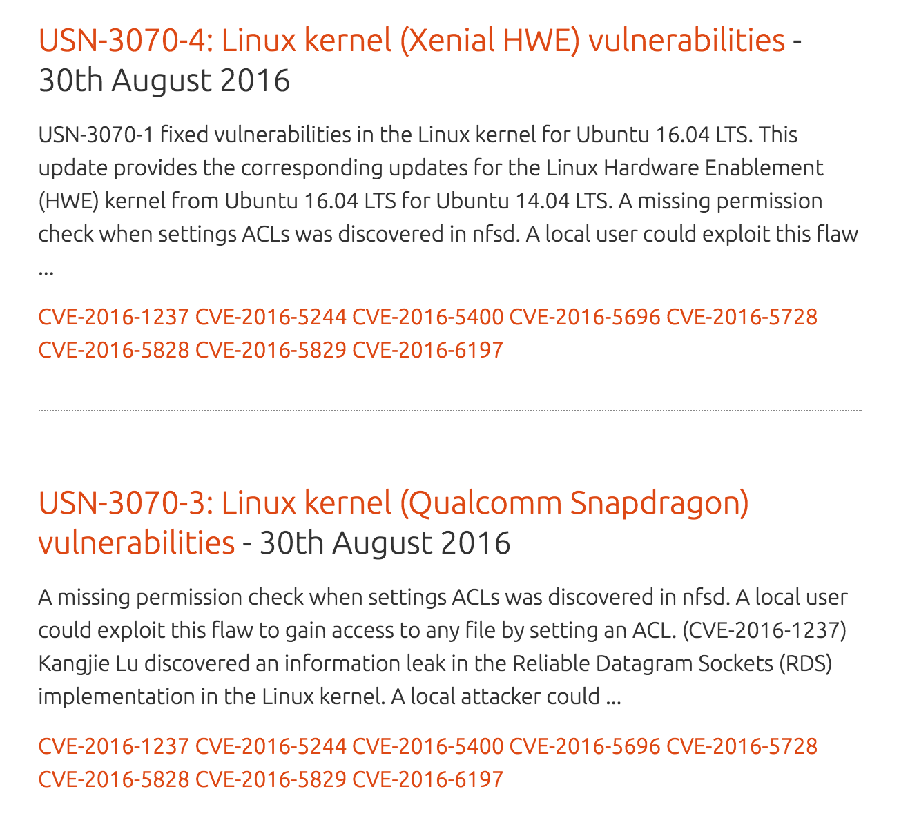

To create a schema that extracts list-of-lists use the “Create List” button to create one list, add the desired items to that list (as described above), click on the created list (to highlight it) and then use the “Create List” button to create a second list that will be extracted as a sublist of the first. In the following example we create a list called “security_list”, which in turn contains a list called “cve_list”.

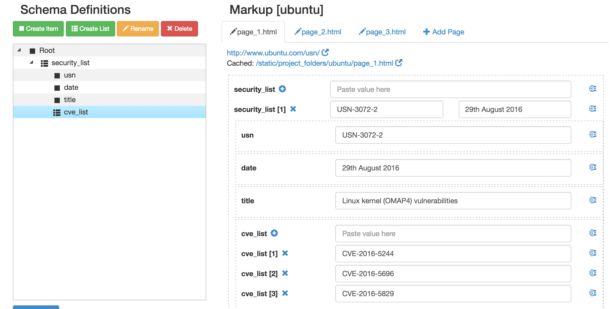

Markup each page as described in “List Extraction”. Note that for a row that contains only one CVE we will have only one row in the markup list (no last row). Use the add/delete row buttons to generate the correct number of row. See **Lists with less than three rows:** described above.

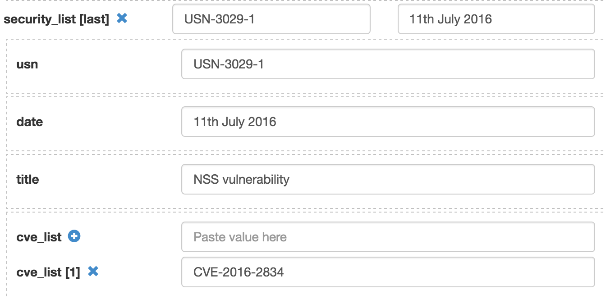
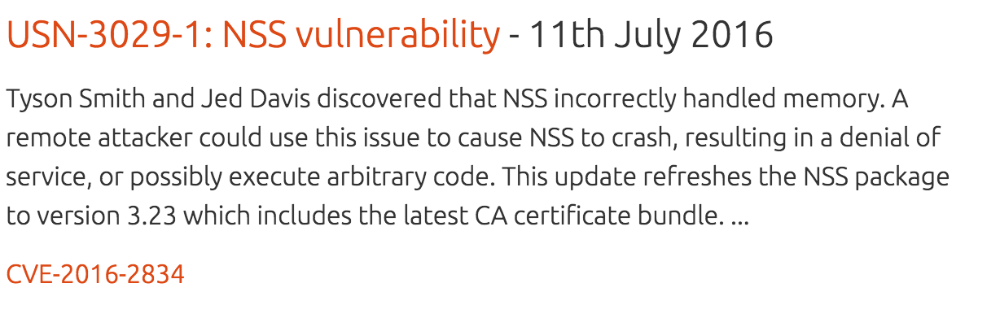

### Learn Rules

Now that we have all sample data, the system is ready to learn the extraction rules. Click on “Learn Rules”. Once the rules are learned, you can inspect them by clicking on the icon at the bottom of the page.

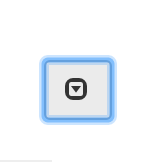

This will open a window where you can inspect both the rules and the markup.

### Test Extraction

In order to test the extraction go to the “Extraction” tab. Check to make sure that the extracted data is what you expect. 

Add a one or two new pages to ensure that the extraction is correct for any page of that type. For example, add page http://www.jair.org/papers/paper5028.html, and check the extracted data.

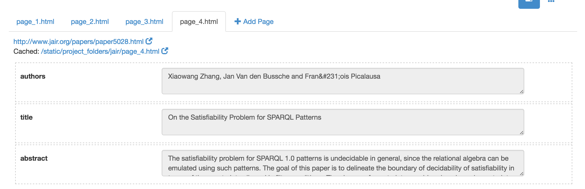

### Download Rules and Markup

The “Downloads” tab allows you to download both rules and markup for any of the created projects.

### Projects on Filesystem

If you need to transfer a project, you can find all project folders under:
```
src/angular_flask/static/project_folders
```


