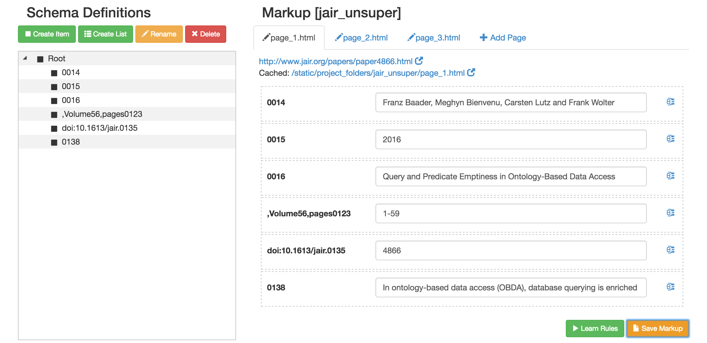
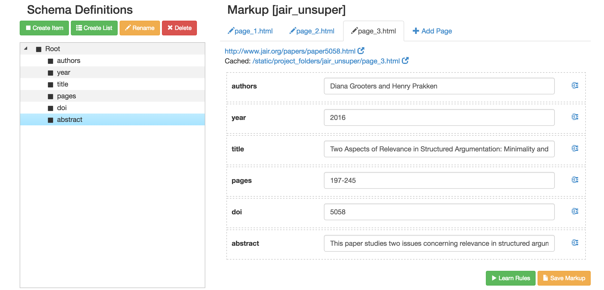
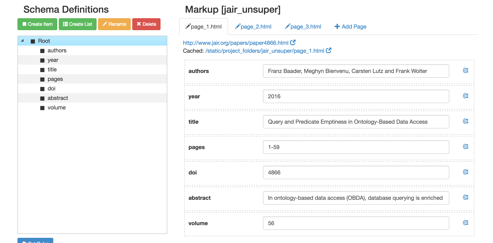

## Installation

Tested with Python 2.7.

### Install Required Packages
```
cd extraction
pip install -r requirements.txt
```

### Import nltk

```
$ python
>>> import nltk
>>> nltk.download()
```
In the UI, click on the Corpora tab. Scroll down and select stopwords, then click download.


## Run
```
cd src
python runserver.py

go to:

localhost:5000
```

### Create a Project

Click “Select Project” and choose “Add New Project”. 


Input project name and click “Let’s Go!”.


### Markup 

The Markup tab allows you to add sample pages and modify the schema if needed.

### Item Extraction

As an example we will use the JAIR (Journal of Artificial Intelligence Research) website: http://www.jair.org/

### Add Sample Pages

Select at least three sample pages and use the “Add Page” button to add them. For each page, click “Add Page”, and input the URL of the sample page. 
```
http://www.jair.org/papers/paper4866.html
http://www.jair.org/papers/paper5007.html
http://www.jair.org/papers/paper5058.html
```

To delete a page, hover over the page name (e.g., page_1.html) and click on the “x”.

### Save Markup

Once the pages have been added, click the “SaveMarkup” button. This will generate a sample schema and a sample markup.



In the newly generated schema we can rename the fields so they reflect the extracted data. Double-click on the field and rename it.



We can also add new fields if desired. For example, we would like to extract the volume number. In the Schema Definition section click on “Root” and then on “Create Item”. This will generate a new node under “Root” that we will call “volume”. As soon as we create a new node, we will see a placeholder for that node in the Sample Page section. 



Once we are happy with the schema and the markup we can learn the rules.


### Learn Rules

Now that we have all sample data, the system is ready to learn the extraction rules. Click on “Learn Rules”. Once the rules are learned, you can inspect them by clicking on the icon at the bottom of the page.


This will open a window where you can inspect both the rules and the markup.

### Test Extraction

In order to test the extraction go to the “Extraction” tab. Check to make sure that the extracted data is what you expect. 

Add a one or two new pages to ensure that the extraction is correct for any page of that type. For example, add page http://www.jair.org/papers/paper5028.html, and check the extracted data.

### Download Rules and Markup

The “Downloads” tab allows you to download both rules and markup for any of the created projects.

### Projects on Filesystem

If you need to transfer a project, you can find all project folders under:
```
src/angular_flask/static/project_folders
```


